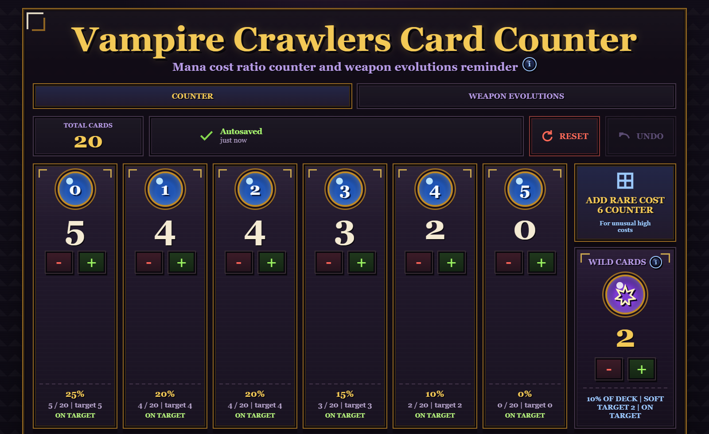
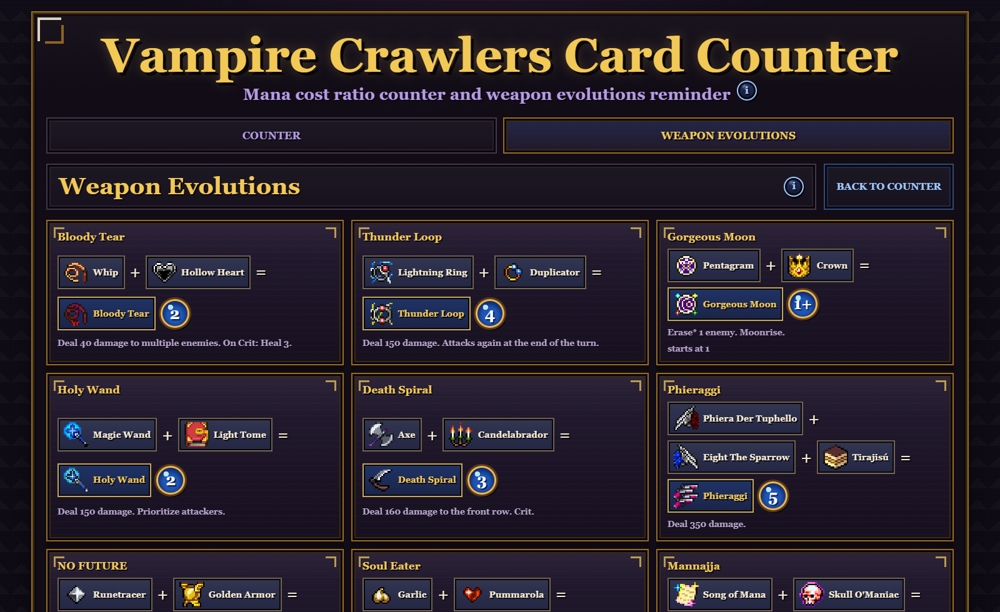

# Vampire Crawlers Card Counter

A static, browser-only companion tool for tracking Vampire Crawlers deck mana costs and weapon evolutions.

## Why I made this

I made this because I kept looking through my deck during a run to count how many cards I had at each mana cost, then checking what the weapon evolutions were at the same time.

I wanted something neat and clean that I could leave open on a second monitor while I played, so I could update the counts quickly without making a card list or stopping the run.

## Screenshots





## What it does

- Tracks mana-cost buckets from `0` through `5` by default.
- Lets you add rare extra high-cost counters, starting with `6-cost`.
- Tracks wild cards separately and gives them a soft rarity-aware target.
- Calculates target counts for a practical combo ratio built around a default 5-card hand.
- Raises low-cost targets when you already have higher-cost cards that need support.
- Adds a Weapon Evolutions tab with the card combinations, evolved names, and resulting mana costs.
- Autosaves to browser `localStorage`.
- Supports undo and reset.

## Target model

The target ratio is meant for keeping combo sequences going in a real run, not for perfect math with unlimited rare cards.

Wild cards are targeted at `12%` of the total deck, capped at `6`. They are useful at any point in a combo, but rare enough that the app treats their target as soft.

5-cost cards are also capped because they are rare:

- `0` target before `24` total cards
- `1` target from `24` to `39` total cards
- `2` target at `40+` total cards

The remaining target cards go into costs `0` through `4` using these weights:

```js
0: 26
1: 24
2: 22
3: 18
4: 10
```

Largest-remainder rounding keeps the target counts adding up exactly to the current total deck size. If you already have more high-cost cards than the baseline target, the app raises the lower-cost targets to support those cards instead of telling you to remove them.

Example targets:

- `10 cards`: `2 / 2 / 2 / 2 / 1 / 0 / 1 wild`
- `20 cards`: `5 / 4 / 4 / 3 / 2 / 0 / 2 wild`
- `25 cards`: `5 / 5 / 5 / 4 / 2 / 1 / 3 wild`
- `30 cards`: `7 / 6 / 6 / 4 / 2 / 1 / 4 wild`
- `40 cards`: `9 / 8 / 7 / 6 / 3 / 2 / 5 wild`

## Download / Use It

This is a plain static site with no build step.

- Download the ZIP from GitHub, unzip it, and open `index.html` in a browser.
- Fork or clone the repo if you want to change it or make your own version.
- Your counts autosave in your own browser only; there is no login, database, or cloud sync.
